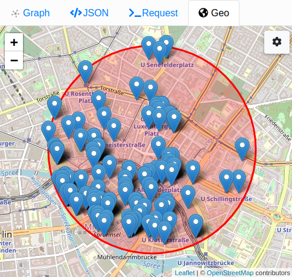

# Dgraph DBpedia Dataset

This projects prepares the [DBpedia dataset](http://downloads.dbpedia.org/)
for loading into [Dgraph](https://dgraph.io/). This comprises the steps
[download](#download-dbpedia), [extraction](#extract-dbpedia), [pre-processing](#pre-processing)
and [bulk loading](#run-dgraph-bulk-loader).
The first two steps can be done with provided shell scripts.
The third step by using [Apache Spark transformations](SPARK.md).
The last step uses the [Dgraph Bulk Loader](https://dgraph.io/docs/deploy/fast-data-loading/#bulk-loader).

## A large real-world dataset
I was looking for a large real-world graph dataset to load into a Dgraph cluster to ultimately test
the [spark-dgraph-connector](https://github.com/G-Research/spark-dgraph-connector).
Dgraph organizes the graph around predicates, so that dataset should contain predicates with these characteristics:

- a predicate that links a **deep hierarchy** of nodes
- a predicate that links a **deep network** of nodes
- a predicate that links **strongly connected components**
- a predicate with a lot of data, ideally a long string that exists for **every** node and with **multiple** languages
- a predicate with **geo coordinates**
- numerous predicates, to have a **large** schema
- a **long-tail** predicate frequency distribution:
  a few predicates have high frequency (and low selectivity),
  most predicates have low frequency (and high selectivity)
- predicates that, if they exist for a node:
  - have a single occurrence (single value)
  - have multiple occurrences (value list)
- real-world predicate names in multiple languages
- various data types and strings in multiple languages

A dataset that checks all these boxes can be found at the [DBpedia project](https://wiki.dbpedia.org/).
They extract structured information from the [Wikipedia project](https://wikipedia.org/) and provide them in RDF format.
However, that RDF data requires some preparation before it can be loaded into Dgraph.
The size of the datasets requires a scalable pre-processing step.

This project uses [Apache Spark](https://spark.apache.org/) to bring real-work graph data into a Dgraph-compatible shape.
[Read the detailed tutorial on the pre-processing steps](SPARK.md).

## Requirements

This tutorial has the following requirements:

- Unix command line shell bash
- [Apache Maven](https://maven.apache.org/) installed
- [Docker](https://www.docker.com/) CLI installed
- A multi-core machine with SSD disk
- Disk space: 19 GB to download, 374 GB to extract, 42 GB for parquet, 21 GB for gz'ed RDF,
  64 GB Dgraph alpha space and 75 GB temporary space

Run the following command on an Ubuntu instance to get it setup:

    sudo apt update
    sudo apt install -y git maven parallel docker.io zip
    sudo usermod -aG docker ${USER}  # you may need run `sudo systemctl restart docker` and re-login for this to work
    git clone https://github.com/G-Research/dgraph-dbpedia.git
    cd dgraph-dbpedia

## Datasets

This tutorial uses the following datasets from [DBpedia project](https://wiki.dbpedia.org/):

|dataset             |filename                        |description|
|--------------------|--------------------------------|-----------|
|labels              |`labels_{lang}.ttl`             |Each article has a single title in the article's language.|
|category            |`article_categories_{lang}.ttl` |Some articles link to categories, multiple categories allowed.|
|skos                |`skos_categories_{lang}.ttl`    |Categories link to broader categories. Forms a deep hierarchy.|
|inter-language links|`interlanguage_links_{lang}.ttl`|Articles link to the same article in all other languages. Forms strongly connected components.|
|page links          |`page_links_{lang}.ttl`         |Articles link to other articles or other resources. Forms a network of articles.|
|infobox             |`infobox_properties_{lang}.ttl` |Some articles have infoboxes. Provides structured information as key-value tables.|
|geo coordinates     |`geo_coordinates_{lang}.ttl`    |Some articles have geo coordinates of type `Point`.|
|en_uris             |`{dataset}_en_uris_{lang}.ttl`  |Non-English `labels`, `infobox` and `category` predicates for English articles. Provides multiple language strings and predicates for articles.|

The `infobox` dataset provides real-world user-generated multi-language predicates.
The other datasets provide a fixed set of predicates each.

The `{dataset}_en_uris_{lang}.ttl` dataset is special. For three datasets `labels`, `infobox` and `category`,
it provides non-English data for English articles. All data from these datasets are stored in parquet
and RDF under the `en-{lang}` languages. For instance, when you run `DbpediaDgraphSparkApp` with
languages `en` and `de`, then you will also get the `{dataset}_en_uris_de.ttl` dataset as language `en-de` as well.
Without the `en` language, you will not get any of the `{dataset}_en_uris_{lang}.ttl` datasets.

## Mix-and-Match your dataset

You can easily prepare any subset of this dataset. Download only those datasets and languages that you are interested in.
Start with a small language to go through these steps once. Then download and prepare all languages that you want.

Even when you download and pre-process all datasets and all languages into RDF you will be able
to pick datasets and languages when bulk-loading data into Dgraph. RDF files are split by languages
and the schema is additionally split by dataset, so that you can easily load the schema only of the dataset
that you are bulk loading.

## Download DBpedia

Use the `download.sh` script to download the datasets and languages that you want to load into Dgraph:

    ./download.sh [path] [languages]

Both arguments `path` and `languages` are optional. Without, the script downloads all languages into
`./dbpedia`. To download only selected languages, run

    ./download.sh dbpedia "en es fr zh jp"

You can find all available releases and datasets at http://downloads.dbpedia.org.
Stats for each release date are published in the `statsitics` sub-directory,
e.g. http://downloads.dbpedia.org/2016-10/statistics.

Downloading the four datasets in all languages will require 19 GB disk space.

## Extract DBpedia

DBpedia datasets are compressed and will be pre-processed using Spark. The compressed
files cannot be processed efficiently, so they have to be extracted first.

Run the `extract.sh` script:

    ./extract.sh dbpedia/2016-10

Extracting the four datasets in all languages will require 374 GB disk space.

## Pre-Processing

The provided Scala Spark code pre-processes the downloaded and extracted datasets
and produces [Dgraph compatible RDF triples](https://dgraph.io/docs/mutations/triples).

First we produce parquet files from all `ttl` files. All languages will be stored
in one parquet directory per dataset, where languages can still be selected in later steps.

    MAVEN_OPTS=-Xmx2g mvn compile exec:java -Dexec.cleanupDaemonThreads=false -Dexec.mainClass="uk.co.gresearch.dgraph.dbpedia.DbpediaToParquetSparkApp" -Dexec.args="dbpedia 2016-10"

Secondly, process these parquet files into RDF triple files:

    MAVEN_OPTS=-Xmx8g mvn compile exec:java -Dexec.cleanupDaemonThreads=false -Dexec.mainClass="uk.co.gresearch.dgraph.dbpedia.DbpediaDgraphSparkApp" -Dexec.args="dbpedia 2016-10"

These commands can optionally be given a comma separated list of language codes: `-Dexec.args="dbpedia 2016-10 en,es,fr,de"`.
Without those language codes, all languages will be processed.

There are more options at the beginning of the `main` method in `DbpediaDgraphSparkApp.scala`:

    val externaliseUris = false
    val removeLanguageTags = false
    val topInfoboxPropertiesPerLang = Some(100)
    val printStats = true

With `externaliseUris = true` the application turns all URIs into blank nodes and produces a `external_ids.rdf` file
which provides the `<xid>` predicate for each blank node with the URI as a string value.
See [External IDs](https://dgraph.io/docs/mutations/external-ids/) for more information.

Language tags can be removed from any value with `removeLanguageTags = true`. The `@lang` directives
are then also removed from the schema files `schema.dgraph` and `schema.indexed.dgraph`.

Only the `100` largest infobox properties are provided in the RDF files with `topInfoboxPropertiesPerLang = Some(100)`.
This can be used to control the size of the schema while allowing to add rich predicates.
Use `None` to get all 1 mio predicates from all datasets and languages.

With `printStats = false` you can turn-off some stats, which will reduce the processing time of the application.

### Memory Requirements

The `DbpediaDgraphSparkApp` requires at least 1 GB per CPU core, ideally 2 GB.
You can set the memory available to the application via the `MAVEN_OPTS` environment variable:

    MAVEN_OPTS=-Xmx8g mvn compile exec:java …

On termination, the application prints some information like the following line:

    memory spill: 51 GB  disk spill: 4 GB  peak mem per host: 874 MB

This provides an indication if more memory should be given to the application.
A huge number (upper two digits GB) for `disk spill` indicates lag of memory per core.

## Generated Dataset Files

Above example

- downloads to `dbpedia/2016-10/core-i18n/{lang}/{dataset}_{lang}.ttl.bz2`
- extracts to `dbpedia/2016-10/core-i18n/{lang}/{dataset}_{lang}.ttl`
- loads into `dbpedia/2016-10/core-i18n/{dataset}.parquet`
- pre-processes to `dbpedia/2016-10/core-i18n/{dataset}.rdf`
- write schema to `dbpedia/2016-10/core-i18n/schema.dgraph` and `dbpedia/2016-10/core-i18n/schema.indexed.dgraph`

Individual languages can be found in `dbpedia/2016-10/core-i18n/{dataset}.rdf/lang={language}`.

Besides the datasets `article_categories.rdf`, `infobox_properties.rdf`, `interlanguage_links.rdf`,
`labels.rdf`, `skos_categories_{lang}.rdf`, `page_links_{lang}.rdf` and `geo_coordinates_{lang}.rdf`,
you can find data from `{dataset}_en_uris_{lang}.ttl` in `{dataset}.rdf/lang=en-{lang}`.
External ids can be found (when `externaliseUris = true`) in `external_ids.rdf`.

The schema for all predicates with and without indices are provided in `schema.dgraph` and
`schema.indexed.dgraph`, respectively.

## Run Dgraph Bulk Loader

Load all datasets and all languages:

    ./dgraph.bulk.sh $(pwd)/dbpedia/2016-10/core-i18n $(pwd)/dbpedia/2016-10/bulk "/data/schema.indexed.dgraph/dataset=*/lang=*/part-*.txt" "/data/*.rdf/lang=*/part-*.txt.gz"

Load a subset of datasets and languages, defined via `langs` and `datasets`:

    export langs="en|en-es|en-fr|en-zh|en-jp"; export datasets="labels|infobox_properties"; ./dgraph.bulk.sh $(pwd)/dbpedia/2016-10/core-i18n $(pwd)/dbpedia/2016-10/bulk "/data/schema.dgraph/dataset=@($datasets)/lang=@($langs|any)/part-*.txt" "/data/@($datasets).rdf/lang=@($langs)/part-*.txt.gz"

Either use `schema.indexed.dgraph` with bulk loader to populate the indices during bulk loading,
or bulk load with `schema.dgraph` and mutate the schema to `schema.indexed.dgraph` afterwards.

<!-- Bulk-loading the full dataset takes 2 1/2 hours and requires 122 GB RAM and 106 GB disk space (v20.07.1 with schema.indexed.dgraph). -->
Bulk-loading the full dataset takes 3 hours and requires 120 GB RAM and 65 GB disk space (v20.11.0-g1003e71bd with schema.indexed.dgraph)
and 2 1/2 hours with 85 GB RAM and 65 GB disk space (v21.03.0).

## Exploring the Graph

Start the Dgraph cluster on your bulk-loaded data:

    ./dgraph.serve.sh $(pwd)/dbpedia/2016-10/bulk

Serving the full dataset (with top-100 infobox properties) requires at least 4 GB RAM.

Then open up Ratel UI:

    http://localhost:8000/?latest#

Connect to the cluster and then query in the Console.

### Example Queries

Query for the wikipedia article about [Wikipedia](https://en.wikipedia.org/wiki/Wikipedia) (http://dbpedia.org/page/Wikipedia):

    {
      query(func: eq(<xid>, "http://dbpedia.org/resource/Wikipedia")) {
        uid
        xid
        <http://www.w3.org/2000/01/rdf-schema#label>@*
        <http://www.w3.org/2002/07/owl#sameAs> {
          uid
          xid
          <http://www.w3.org/2000/01/rdf-schema#label>@*
          }
      }
    }

Result:

    {
      "data": {
        "query": [
          {
            "uid": "0x191439",
            "xid": "http://dbpedia.org/resource/Wikipedia",
            "http://www.w3.org/2000/01/rdf-schema#label@ne": "विकिपिडिया",
            "http://www.w3.org/2000/01/rdf-schema#label@yo": "Wikipedia",
            "http://www.w3.org/2000/01/rdf-schema#label@sco": "Wikipaedia",
            "http://www.w3.org/2000/01/rdf-schema#label@gd": "Uicipeid",
            "http://www.w3.org/2000/01/rdf-schema#label@si": "විකිපීඩියා",
            "http://www.w3.org/2000/01/rdf-schema#label@pa": "ਵਿਕੀਪੀਡੀਆ",
            "http://www.w3.org/2000/01/rdf-schema#label@pms": "Wikipedia",
            "http://www.w3.org/2000/01/rdf-schema#label@ce": "Википеди",
            "http://www.w3.org/2000/01/rdf-schema#label@az": "Vikipediya",
            "http://www.w3.org/2000/01/rdf-schema#label@nah": "Huiquipedia",
            "http://www.w3.org/2000/01/rdf-schema#label@zh": "维基百科",
            "http://www.w3.org/2000/01/rdf-schema#label@su": "Wikipédia",
            "http://www.w3.org/2000/01/rdf-schema#label@ml": "വിക്കിപീഡിയ",
            "http://www.w3.org/2000/01/rdf-schema#label@vo": "Vükiped",
            "http://www.w3.org/2000/01/rdf-schema#label@ka": "ვიკიპედია",
            "http://www.w3.org/2000/01/rdf-schema#label@ckb": "ویکیپیدیا",
            "http://www.w3.org/2000/01/rdf-schema#label@be": "Вікіпедыя",
            "http://www.w3.org/2000/01/rdf-schema#label@sl": "Wikipedija",
            "http://www.w3.org/2000/01/rdf-schema#label@bpy": "উইকিপিডিয়া",
            "http://www.w3.org/2000/01/rdf-schema#label@am": "ውክፔዲያ",
            "http://www.w3.org/2000/01/rdf-schema#label@my": "ဝီကီပီးဒီးယား",
            "http://www.w3.org/2000/01/rdf-schema#label@ko": "위키백과",
            "http://www.w3.org/2000/01/rdf-schema#label@te": "వికీపీడియా",
            "http://www.w3.org/2000/01/rdf-schema#label@th": "วิกิพีเดีย",
            "http://www.w3.org/2000/01/rdf-schema#label@sah": "Бикипиэдьийэ",
            "http://www.w3.org/2000/01/rdf-schema#label@ur": "ویکیپیڈیا",
            "http://www.w3.org/2002/07/owl#sameAs": [
              {
                "uid": "0x18cd82",
                "xid": "http://tl.dbpedia.org/resource/Wikipedia",
                "http://www.w3.org/2000/01/rdf-schema#label@tl": "Wikipedia"
              },
              {
                "uid": "0x558f93",
                "xid": "http://de.dbpedia.org/resource/Wikipedia",
                "http://www.w3.org/2000/01/rdf-schema#label@de": "Wikipedia"
              },
              {
                "uid": "0x61c424",
                "xid": "http://ky.dbpedia.org/resource/Уикипедия",
                "http://www.w3.org/2000/01/rdf-schema#label@ky": "Уикипедия"
              },
              {
                "uid": "0x61c425",
                "xid": "http://ml.dbpedia.org/resource/വിക്കിപീഡിയ",
                "http://www.w3.org/2000/01/rdf-schema#label@ml": "വിക്കിപീഡിയ"
              },
              …
            ]
          }
        ]
      }
    }

Query for things in Berlin, Germany:

    {
      query(func: near(<http://www.georss.org/georss/point>, [13.41053, 52.52437], 1000), first: 1000) {
        uid
        name: <http://www.w3.org/2000/01/rdf-schema#label>@*
        location: <http://www.georss.org/georss/point>
      }
    }

## Statistics

### Dataset Statistics

|dataset|triples|nodes|predicates|.bz |.ttl|.parquet|.rdf|schema|
|:------|------:|----:|---------:|---:|---:|-------:|---:|:-----|
|labels|94,410,463|76,478,687|1|1 GB|12 GB|2 GB|1 GB|`Article --rdfs:label-> lang string`|
|article_categories|149,254,994|41,655,032|1|1 GB|22 GB|3 GB|2 GB|`Article --dcterms:subject-> Category`|
|skos_categories|32,947,632|8,447,863|4|0.3 GB|8 GB|0.7 GB|0.4 GB|`Category --skos-core:broader-> Category`|
|interlanguage_links|546,769,314|49,426,513|1|5 GB|92 GB|11 GB|5 GB|`Article --owl:sameAs-> Article`|
|page_links|1,042,567,811|76,392,179|1|7 GB|154 GB|17 GB|10 GB|`Article --dbpedia:wikiPageWikiLink-> Article`|
|geo_coordinates|1,825,817|1,825,817|1|0.05 GB|1 GB|0.1 GB|0.03 GB|`Article --georss:point-> geoJSON`|
|top-100 infobox_properties|298,289,529|27,332,261|12,714| | | |3 GB|`Article --property-> literal or uri`|
|all (with top-100 infobox)|2,166,065,560|86,737,376|12,723| | | |21 GB| |
||||||||||
|all infobox_properties|596,338,417|29,753,821|1,050,875|4 GB|87 GB|9 GB|6 GB|`Article --property-> literal or uri`|
|all (with all infobox)|2,396,517,559|86,737,376|1,050,884|19 GB|372 GB|42 GB|24 GB| |

The original dataset files are `.bz2` compressed and 19 GB in size. They extract to `.ttl` files of 374 GB size.

Those loaded into parquet consume 42 GB, processed into TTL RDF files (with top 100 infobox properties)
occupy 21 GB `.gz` compressed and 317 GB uncompressed.

The RDF loaded into Dgraph requires 36 GB for the `out` directory with indices and 27 GB without, 7 GB for `xidmap`, and 16 GB for `zw`.
 
Loading the entire dataset into parquets takes 2 hours on an 8-core machine with SSD disk and 2 GB JVM memory.
This requires 10 to 30 GB of temporary disk space, depending on the dataset that your are loading.
With a 32-core machine and 32 GB JVM memory, this takes 35 min and 32 GB temporary disk space.

Processing the dataset into RDF takes 1 1/2 hours on a 8-core machine with SSD disk and 12 GB JVM memory.
With a 32-core machine and 96 GB JVM memory, this takes 30 min and 32 GB temporary disk space.

Loading the RDF into Dgraph takes 3 hours with indices and 2 1/2 hours without, and requires 120 GB RAM.

### Language Statistics

The following language codes are available for the `2016-10` datasets in `core-i18n`:

    af als am an ar arz ast az azb ba bar be bg bn bpy br bs bug
    ca ce ceb ckb cs cv cy da de el en eo es et eu fa fi fo fr fy
    ga gd gl gu he hi hr hsb ht hu hy ia id io is it ja jv ka kk
    kn ko ku ky la lb li lmo lt lv mg min mk ml mn mr mrj ms my
    mzn nah nap nds ne new nl nn no oc or os pa pl pms pnb pt qu
    ro ru sa sah scn sco sh si sk sl sq sr su sv sw ta te tg th
    tl tr tt uk ur uz vec vi vo wa war yi yo zh

These datasets provide the following number of triples per language:

<!--
paste the table printed by `DbpediaDgraphSparkApp` when run on the full dataset here
then replace (\d)(\d{3}\D) with $1,$2 until no matches exist anymore (adds thousand separator character)
then remove all null
-->

|lang|labels  |interlanguage      |page links|categories        |skos           |geo            |infobox           |top 100 infobox           |
|:---|-------:|------------------:|---------:|-----------------:|--------------:|--------------:|-----------------:|-------------------------:|
|af  |62,902   |1,875,080            |1,025,708   |64,901             |27,722          |               |468,032            |254,962                    |
|als |27,077   |942,457             |544,847    |45,067             |12,328          |1              |216,224            |154,004                    |
|am  |19,697   |566,489             |116,211    |16,300             |3,194           |250            |28,372             |23,039                     |
|an  |57,240   |1,790,964            |1,155,374   |62,983             |65,608          |37             |384,921            |267,495                    |
|ar  |871,405  |8,456,373            |9,470,455   |1,942,195           |797,717         |12,899          |4,574,804           |2,727,047                   |
|arz |22,803   |802,974             |235,009    |48,724             |19,255          |689            |54,399             |26,510                     |
|ast |55,036   |1,588,057            |1,686,826   |161,813            |20,438          |205            |396,939            |299,062                    |
|az  |143,422  |3,436,415            |1,519,074   |219,855            |194,832         |780            |783,088            |510,857                    |
|azb |13,391   |236,252             |111,743    |13,468             |6,828           |28             |76,616             |65,412                     |
|ba  |42,116   |1,274,257            |448,334    |71,464             |76,453          |48             |500,493            |431,324                    |
|bar |34,916   |1,038,524            |633,300    |48,230             |27,264          |               |189,491            |144,376                    |
|be  |217,992  |4,071,053            |2,492,728   |307,957            |216,374         |1,182           |1,036,032           |763,998                    |
|bg  |333,098  |5,662,926            |5,613,997   |491,931            |209,189         |2,394           |1,199,635           |751,318                    |
|bn  |214,617  |2,017,159            |1,238,572   |152,577            |86,507          |2,824           |676,004            |357,148                    |
|bpy |25,404   |1,013,214            |206,059    |33,187             |18,421          |242            |288,330            |278,184                    |
|br  |79,421   |2,486,979            |1,349,937   |122,690            |66,130          |25             |163,068            |142,927                    |
|bs  |170,881  |2,963,799            |2,531,453   |184,450            |189,966         |486            |1,122,106           |846,358                    |
|bug |14,230   |459,340             |128,339    |14,239             |1,158           |               |3,345              |3,286                      |
|ca  |868,322  |8,919,143            |15,628,064  |999,079            |254,533         |89,582          |5,555,600           |3,829,640                   |
|ce  |157,642  |870,894             |1,086,175   |165,082            |14,290          |748            |2,152,346           |2,126,202                   |
|ceb |4,864,101 |12,223,691           |40,602,693  |6,060,892           |543,714         |297,725         |48,599,129          |48,590,356                  |
|ckb |56,402   |1,623,083            |256,694    |46,733             |78,501          |710            |121,163            |88,801                     |
|cs  |593,897  |7,280,033            |13,186,669  |1,455,928           |441,698         |1              |3,548,877           |2,356,619                   |
|cv  |38,674   |972,803             |484,472    |66,606             |12,986          |57             |322,440            |277,126                    |
|cy  |124,873  |2,670,515            |4,791,110   |189,369            |99,216          |1,114           |5,867,747           |5,758,012                   |
|da  |353,730  |5,433,263            |6,026,849   |574,511            |191,523         |18,871          |1,827,254           |967,812                    |
|de  |3,343,471 |16,120,815           |68,802,723  |8,185,499           |1,155,538        |9              |14,048,415          |8,898,574                   |
|el  |185,210  |3,663,190            |3,447,861   |314,211            |153,419         |12,774          |497,520            |235,298                    |
|en  |12,845,252|29,476,295           |183,605,695 |23,990,512          |6,083,029        |580,892         |52,680,098          |26,966,738                  |
|en-*|17,933,697|                   |          |36,147,553          |               |               |178,020,543         |24,657,904                  |
|eo  |393,119  |6,096,191            |6,008,777   |527,912            |203,701         |               |1,949,066           |1,416,087                   |
|es  |2,906,977 |15,451,078           |44,035,493  |3,622,137           |1,348,394        |40,737          |10,858,241          |5,925,338                   |
|et  |260,421  |3,761,071            |4,392,950   |320,249            |92,385          |507            |501,304            |339,731                    |
|eu  |333,949  |7,018,090            |4,192,367   |427,983            |202,547         |               |2,046,149           |1,703,815                   |
|fa  |1,891,729 |10,313,741           |10,296,006  |2,381,913           |1,652,569        |31,687          |6,827,706           |4,054,788                   |
|fi  |637,527  |7,364,185            |10,472,218  |1,034,362           |240,662         |16,105          |3,793,465           |2,166,251                   |
|fo  |17,243   |1,000,468            |235,030    |22,348             |15,002          |38             |49,932             |30,778                     |
|fr  |3,241,245 |18,386,234           |64,055,280  |6,549,308           |1,394,960        |37,801          |16,052,506          |9,190,531                   |
|fy  |56,325   |1,397,933            |1,087,488   |104,970            |74,218          |               |92,718             |74,624                     |
|ga  |45,636   |1,574,022            |475,562    |64,936             |19,600          |680            |82,344             |49,163                     |
|gd  |22,609   |758,946             |229,342    |26,292             |5,415           |1,133           |22,202             |20,921                     |
|gl  |184,059  |3,767,468            |4,199,110   |317,526            |175,457         |10,860          |597,615            |314,287                    |
|gu  |29,004   |381,512             |557,348    |59,909             |3,521           |190            |406,231            |375,655                    |
|he  |360,725  |4,848,271            |9,061,515   |614,735            |185,868         |15,205          |1,287,035           |757,865                    |
|hi  |157,515  |2,088,013            |1,612,841   |208,076            |75,325          |3              |483,805            |278,581                    |
|hr  |204,330  |3,720,040            |4,086,321   |281,986            |61,525          |3,137           |1,274,116           |805,129                    |
|hsb |15,246   |684,769             |191,381    |21,852             |14,075          |6              |100,225            |93,021                     |
|ht  |57,587   |1,033,648            |360,968    |126,744            |3,804           |6              |245,047            |243,681                    |
|hu  |577,761  |8,135,897            |12,321,943  |1,114,368           |202,481         |               |3,844,734           |2,021,889                   |
|hy  |519,477  |4,474,158            |3,911,694   |420,750            |152,196         |1,141           |2,656,709           |2,171,465                   |
|ia  |23,041   |939,137             |135,455    |17,079             |10,803          |11             |1,334              |1,139                      |
|id  |660,719  |6,611,139            |8,288,264   |596,902            |212,629         |12,455          |2,753,661           |1,543,213                   |
|io  |30,601   |1,492,156            |443,393    |37,164             |20,514          |3              |96,793             |89,943                     |
|is  |65,226   |1,848,537            |876,343    |61,213             |46,129          |61             |171,318            |128,153                    |
|it  |1,949,794 |15,542,736           |43,346,247  |1,786,162           |1,161,845        |15,681          |20,207,833          |13,932,773                  |
|ja  |1,663,028 |10,522,965           |51,368,506  |4,271,371           |768,230         |25,338          |7,763,985           |2,530,605                   |
|jv  |64,481   |1,580,360            |834,417    |61,553             |54,885          |532            |436,879            |320,303                    |
|ka  |144,916  |3,587,693            |1,994,541   |208,311            |114,438         |2,433           |1,236,797           |897,810                    |
|kk  |267,062  |4,107,418            |2,260,768   |326,357            |68,748          |605            |2,998,438           |2,836,655                   |
|kn  |27,449   |590,437             |549,420    |47,789             |9,503           |274            |169,705            |94,659                     |
|ko  |670,310  |7,838,730            |9,968,592   |1,420,036           |777,602         |16,353          |2,381,529           |1,074,711                   |
|ku  |36,155   |893,677             |311,644    |34,256             |20,105          |               |78,004             |64,317                     |
|ky  |61,403   |1,071,799            |337,477    |86,725             |5,528           |19             |452,740            |436,223                    |
|la  |176,958  |4,474,648            |2,491,031   |286,766            |131,377         |710            |380,644            |307,013                    |
|lb  |58,701   |1,982,488            |1,322,664   |105,622            |86,392          |125            |172,366            |145,641                    |
|li  |43,769   |578,532             |367,905    |17,166             |7,151           |1              |10,789             |10,527                     |
|lmo |48,949   |1,369,828            |459,111    |24,824             |15,727          |358            |466,870            |430,165                    |
|lt  |259,153  |3,766,343            |4,031,031   |277,495            |90,806          |7,581           |1,526,071           |1,093,156                   |
|lv  |168,190  |2,991,527            |1,918,216   |174,077            |95,940          |1,109           |798,879            |413,172                    |
|mg  |124,431  |1,797,354            |954,285    |186,863            |8,580           |34,897          |337,922            |336,717                    |
|min |222,999  |1,341,378            |1,753,645   |219,550            |3,496           |41             |1,876,798           |1,861,140                   |
|mk  |128,202  |3,598,089            |2,095,968   |184,338            |217,204         |4,304           |641,009            |346,036                    |
|ml  |117,149  |1,528,680            |931,001    |97,310             |66,791          |1,213           |488,500            |260,402                    |
|mn  |24,143   |1,048,103            |364,438    |49,038             |35,692          |93             |179,136            |88,706                     |
|mr  |82,601   |1,682,500            |639,334    |95,619             |47,193          |579            |350,277            |165,420                    |
|mrj |12,491   |498,892             |122,714    |16,304             |3,707           |               |568               |562                       |
|ms  |332,229  |5,382,317            |4,479,346   |430,808            |93,476          |3,757           |3,659,011           |2,703,715                   |
|my  |41,260   |699,731             |354,978    |84,015             |11,120          |139            |460,582            |417,278                    |
|mzn |17,707   |388,110             |113,356    |17,076             |4,289           |275            |94,895             |77,157                     |
|nah |17,088   |648,422             |102,130    |14,371             |9,360           |9              |56,229             |37,643                     |
|nap |15,652   |804,392             |185,862    |38,250             |3,730           |24             |15,386             |9,569                      |
|nds |34,400   |1,019,548            |739,428    |49,845             |7,998           |               |94,701             |83,555                     |
|ne  |36,048   |776,358             |294,915    |72,685             |6,725           |267            |227,119            |151,236                    |
|new |100,918  |1,193,563            |811,948    |77,621             |93,038          |40             |301,295            |278,422                    |
|nl  |2,554,610 |16,134,593           |31,823,749  |2,764,083           |405,781         |273            |8,918,883           |7,058,397                   |
|nn  |206,657  |3,652,079            |2,787,235   |361,068            |220,738         |154            |1,064,516           |732,532                    |
|no  |709,542  |7,855,478            |12,087,904  |1,585,810           |472,339         |1              |2,963,577           |1,752,582                   |
|oc  |98,027   |3,388,435            |1,809,710   |111,315            |56,605          |290            |1,491,784           |1,453,162                   |
|or  |22,359   |736,820             |155,077    |27,071             |13,014          |129            |125,961            |83,250                     |
|os  |20,315   |841,048             |103,564    |14,147             |19,182          |57             |85,549             |74,792                     |
|pa  |36,168   |891,318             |312,123    |32,395             |10,989          |1              |301,477            |186,180                    |
|pl  |1,575,762 |13,958,693           |30,792,002  |3,244,389           |639,723         |               |11,769,485          |7,345,068                   |
|pms |66,943   |1,802,868            |559,036    |75,942             |17,108          |1,684           |646,961            |642,742                    |
|pnb |45,336   |1,366,423            |561,884    |102,912            |12,324          |30             |109,729            |89,559                     |
|pt  |1,667,327 |14,071,743           |26,111,747  |2,373,020           |955,512         |7,566           |7,273,995           |4,220,599                   |
|qu  |39,107   |1,154,083            |482,813    |50,500             |22,010          |6              |63,522             |48,190                     |
|ro  |865,444  |8,232,620            |8,715,289   |826,522            |553,650         |8,412           |6,192,337           |4,450,825                   |
|ru  |3,033,613 |15,350,832           |42,153,229  |3,526,953           |1,291,101        |17,756          |15,382,287          |8,985,787                   |
|sa  |21,614   |904,789             |153,809    |51,314             |20,169          |69             |56,919             |36,343                     |
|sah |15,801   |712,118             |134,674    |20,229             |16,295          |69             |47,695             |28,315                     |
|scn |41,436   |1,166,819            |317,603    |31,203             |5,130           |2              |27,961             |24,454                     |
|sco |52,878   |2,301,910            |1,023,709   |233,832            |114,366         |4,470           |699,297            |408,021                    |
|sh  |3,960,865 |6,545,293            |11,431,459  |816,552            |155,263         |2,143           |5,089,465           |3,821,276                   |
|si  |24,285   |463,985             |188,502    |18,755             |13,546          |556            |99,709             |47,463                     |
|sk  |278,133  |5,968,648            |4,528,315   |392,427            |247,574         |104            |2,370,562           |1,554,812                   |
|sl  |217,345  |3,989,018            |4,883,529   |467,838            |181,334         |               |1,355,263           |859,228                    |
|sq  |84,404   |1,964,847            |980,879    |120,438            |33,587          |2,985           |428,661            |325,805                    |
|sr  |873,929  |6,715,446            |7,183,655   |636,686            |135,090         |1,450           |2,073,765           |1,377,521                   |
|su  |22,545   |824,097             |322,313    |36,203             |24,601          |280            |101,861            |76,459                     |
|sv  |5,858,202 |20,493,578           |63,821,423  |8,408,876           |1,173,139        |299,191         |41,295,967          |38,208,922                  |
|sw  |51,278   |1,628,706            |591,589    |65,319             |36,065          |214            |151,412            |123,731                    |
|ta  |125,998  |1,927,015            |1,487,866   |187,259            |61,573          |2,703           |800,562            |452,151                    |
|te  |90,316   |800,772             |1,140,325   |102,931            |31,923          |548            |1,118,134           |994,441                    |
|tg  |82,736   |1,177,613            |532,675    |121,149            |32,152          |6,517           |424,596            |408,041                    |
|th  |244,223  |3,508,792            |3,246,722   |301,716            |166,312         |3,846           |1,321,855           |566,476                    |
|tl  |164,847  |2,160,417            |772,135    |88,863             |42,157          |969            |236,413            |139,259                    |
|tr  |521,200  |7,048,194            |7,850,843   |1,041,967           |700,464         |8,897           |2,991,863           |1,857,031                   |
|tt  |123,267  |1,789,671            |937,155    |118,971            |56,252          |869            |668,986            |598,652                    |
|uk  |1,049,249 |10,867,075           |16,777,605  |1,751,135           |542,868         |55,597          |7,691,426           |4,292,580                   |
|ur  |299,824  |4,365,211            |1,802,815   |227,783            |827,800         |1,326           |2,049,929           |1,582,299                   |
|uz  |444,074  |3,499,627            |1,061,031   |105,056            |40,227          |45             |2,418,037           |2,371,000                   |
|vec |17,446   |812,239             |174,803    |12,428             |10,141          |43             |115,966            |97,023                     |
|vi  |1,340,313 |11,542,962           |15,831,995  |2,185,821           |659,046         |5,895           |14,322,161          |11,726,191                  |
|vo  |242,292  |2,983,432            |971,438    |326,248            |4,556           |237            |543,840            |543,529                    |
|wa  |28,779   |372,075             |203,900    |9,443              |4,530           |1              |148               |148                       |
|war |2,094,871 |10,387,067           |16,711,018  |2,084,543           |445,305         |49             |13,056,238          |13,042,101                  |
|yi  |24,284   |656,132             |232,315    |20,089             |7,215           |908            |25,925             |22,087                     |
|yo  |41,250   |1,274,425            |194,529    |32,508             |9,965           |192            |121,360            |70,414                     |
|zh  |1,620,943 |12,090,949           |23,162,842  |2,220,362           |956,624         |76,187          |8,780,134           |3,868,731                   |

|lang  |labels  |categories        |infobox           |top 100 en infobox        |
|:-----|-------:|-----------------:|-----------------:|-------------------------:|
|en-af |35,309  |51,876             |391,625            |35,201                     |
|en-als|17,468  |23,019             |182,854            |10,734                     |
|en-am |6,600   |3,012              |18,094             |2,509                      |
|en-an |26,123  |39,091             |310,031            |9,999                      |
|en-ar |300,446 |1,449,091           |3,221,789           |551,376                    |
|en-arz|10,387  |21,663             |40,954             |8,665                      |
|en-ast|36,925  |52,425             |259,835            |37,846                     |
|en-az |69,856  |83,202             |514,522            |40,962                     |
|en-azb|4,243   |791               |34,889             |9,268                      |
|en-ba |9,025   |13,600             |165,147            |2,014                      |
|en-bar|16,816  |19,160             |128,336            |7,623                      |
|en-be |70,479  |123,662            |606,574            |38,522                     |
|en-bg |162,125 |291,602            |961,885            |132,417                    |
|en-bn |38,017  |68,515             |554,805            |181,305                    |
|en-bpy|19,066  |14,251             |194,010            |30,096                     |
|en-br |50,395  |71,121             |140,924            |16,526                     |
|en-bs |42,104  |71,279             |561,564            |35,786                     |
|en-bug|14,092  |14,054             |1,854              |1,571                      |
|en-ca |355,188 |480,650            |3,850,141           |224,554                    |
|en-ce |7,709   |2,556              |108,573            |920                       |
|en-ceb|349,264 |144,447            |4,642,160           |919,702                    |
|en-ckb|15,714  |39,415             |99,844             |12,194                     |
|en-cs |240,361 |684,538            |2,409,585           |362,289                    |
|en-cv |14,174  |7,806              |108,781            |859                       |
|en-cy |59,641  |108,101            |3,755,446           |1,755,178                   |
|en-da |149,242 |299,896            |1,197,952           |135,317                    |
|en-de |1,018,321|2,874,849           |6,715,795           |888,788                    |
|en-el |88,852  |198,997            |407,741            |65,627                     |
|en-eo |175,195 |317,953            |1,507,094           |8,030                      |
|en-es |812,331 |1,803,738           |7,582,341           |492,850                    |
|en-et |89,766  |150,217            |349,470            |16,011                     |
|en-eu |203,312 |284,810            |1,818,402           |26,922                     |
|en-fa |408,741 |1,998,298           |5,727,420           |1,179,780                   |
|en-fi |282,776 |640,176            |2,839,015           |131,360                    |
|en-fo |10,618  |16,725             |40,026             |8,204                      |
|en-fr |1,164,577|2,716,241           |10,395,149          |576,593                    |
|en-fy |22,984  |53,636             |71,920             |483                       |
|en-ga |35,742  |41,172             |65,875             |1,035                      |
|en-gd |12,701  |12,508             |16,845             |692                       |
|en-gl |82,424  |173,203            |457,845            |37,497                     |
|en-gu |6,733   |9,365              |47,133             |10,309                     |
|en-he |149,652 |370,751            |1,027,194           |28,781                     |
|en-hi |50,171  |56,192             |263,077            |75,607                     |
|en-hr |106,899 |165,019            |849,750            |48,572                     |
|en-hsb|7,829   |9,264              |66,803             |92                        |
|en-ht |31,848  |43,396             |138,019            |38                        |
|en-hu |286,766 |588,257            |2,811,827           |342,155                    |
|en-hy |104,196 |123,199            |1,394,821           |31,961                     |
|en-ia |16,091  |14,839             |999               |107                       |
|en-id |193,462 |252,084            |1,532,013           |567,642                    |
|en-io |26,688  |24,460             |90,873             |385                       |
|en-is |28,061  |29,340             |96,633             |9,349                      |
|en-it |883,922 |880,054            |12,916,139          |1,537,143                   |
|en-ja |459,616 |1,511,162           |4,333,202           |619,562                    |
|en-jv |22,049  |16,890             |179,467            |37,269                     |
|en-ka |78,075  |129,477            |920,729            |79,745                     |
|en-kk |93,549  |88,637             |2,279,074           |16,080                     |
|en-kn |10,832  |6,042              |92,542             |24,490                     |
|en-ko |230,856 |819,163            |1,459,320           |98,693                     |
|en-ku |10,503  |12,675             |42,037             |2,087                      |
|en-ky |24,137  |9,117              |405,913            |2,060                      |
|en-la |115,149 |200,265            |350,765            |19,563                     |
|en-lb |30,999  |52,757             |97,523             |173                       |
|en-li |8,767   |9,040              |8,879              |19                        |
|en-lmo|30,889  |8,933              |424,711            |8,083                      |
|en-lt |101,246 |124,981            |985,057            |101,212                    |
|en-lv |52,420  |107,290            |552,626            |124,933                    |
|en-mg |72,736  |74,857             |286,908            |195                       |
|en-min|23,390  |18,292             |83,093             |30,548                     |
|en-mk |58,003  |100,441            |434,366            |107,648                    |
|en-ml |33,454  |40,961             |321,829            |93,694                     |
|en-mn |13,880  |21,071             |142,688            |23,324                     |
|en-mr |31,062  |36,001             |274,791            |24,084                     |
|en-mrj|9,354   |12,689             |409               |38                        |
|en-ms |201,373 |186,593            |2,357,856           |837,640                    |
|en-my |8,926   |10,060             |66,039             |15,793                     |
|en-mzn|10,006  |5,551              |82,966             |8,111                      |
|en-nah|8,541   |2,837              |37,792             |1,213                      |
|en-nap|13,403  |23,478             |11,345             |39                        |
|en-nds|19,696  |32,042             |71,207             |674                       |
|en-ne |16,382  |16,158             |158,432            |61,844                     |
|en-new|21,908  |3,078              |138,415            |47,817                     |
|en-nl |781,381 |1,164,505           |5,126,717           |835,924                    |
|en-nn |104,700 |224,615            |912,389            |55,215                     |
|en-no |307,842 |894,128            |1,976,148           |75,057                     |
|en-oc |78,455  |70,688             |1,413,692           |1,443                      |
|en-or |9,177   |11,895             |89,095             |33,645                     |
|en-os |7,122   |7,300              |60,487             |1,461                      |
|en-pa |17,558  |8,507              |157,912            |42,070                     |
|en-pl |751,845 |1,504,459           |7,917,683           |472,984                    |
|en-pms|57,198  |55,891             |612,319            |96,133                     |
|en-pnb|34,231  |13,071             |38,643             |12,523                     |
|en-pt |660,417 |1,415,211           |5,514,854           |558,741                    |
|en-qu |16,173  |28,204             |45,351             |3,550                      |
|en-ro |248,287 |451,192            |3,590,140           |683,828                    |
|en-ru |708,594 |1,597,861           |8,982,662           |1,100,867                   |
|en-sa |8,014   |17,629             |41,573             |13,506                     |
|en-sah|7,031   |4,815              |35,263             |7,780                      |
|en-scn|20,984  |21,571             |22,583             |426                       |
|en-sco|40,440  |102,229            |596,071            |207,142                    |
|en-sh |209,987 |302,447            |2,293,914           |190,468                    |
|en-si |8,113   |1,770              |61,447             |17,752                     |
|en-sk |150,113 |225,967            |1,879,808           |100,693                    |
|en-sl |98,948  |236,504            |1,096,815           |421,950                    |
|en-sq |39,881  |50,179             |261,983            |22,605                     |
|en-sr |230,941 |372,975            |1,535,586           |266,585                    |
|en-sah|7,031   |4,815              |35,263             |7,780                      |
|en-scn|20,984  |21,571             |22,583             |426                       |
|en-sco|40,440  |102,229            |596,071            |207,142                    |
|en-sh |209,987 |302,447            |2,293,914           |190,468                    |
|en-si |8,113   |1,770              |61,447             |17,752                     |
|en-sk |150,113 |225,967            |1,879,808           |100,693                    |
|en-sl |98,948  |236,504            |1,096,815           |421,950                    |
|en-sq |39,881  |50,179             |261,983            |22,605                     |
|en-sr |230,941 |372,975            |1,535,586           |266,585                    |
|en-su |9,407   |4,942              |39,573             |7,045                      |
|en-sv |706,492 |1,505,243           |6,617,536           |676,907                    |
|en-sw |27,096  |37,589             |124,131            |50,792                     |
|en-ta |57,327  |87,782             |571,893            |130,296                    |
|en-te |17,156  |17,000             |173,949            |48,393                     |
|en-tg |30,285  |21,488             |196,643            |4,512                      |
|en-th |77,688  |162,113            |860,446            |236,997                    |
|en-tl |51,964  |46,678             |193,284            |49,592                     |
|en-tr |192,817 |651,953            |1,923,748           |381,663                    |
|en-tt |16,207  |16,943             |115,352            |1,187                      |
|en-uk |372,708 |813,905            |4,865,331           |399,708                    |
|en-ur |91,216  |178,833            |1,750,242           |691,392                    |
|en-uz |88,037  |58,237             |2,214,101           |13,286                     |
|en-vec|9,770   |6,777              |103,423            |176                       |
|en-vi |427,099 |751,492            |6,021,715           |1,657,255                   |
|en-vo |116,967 |259,396            |523,047            |87                        |
|en-wa |4,799   |3,801              |117               |25                        |
|en-war|270,261 |157,361            |1,536,543           |433,060                    |
|en-yi |9,393   |12,299             |20,098             |653                       |
|en-yo |29,244  |27,016             |92,121             |28,781                     |
|en-zh |497,704 |834,988            |5,521,741           |1,587,672                   |
